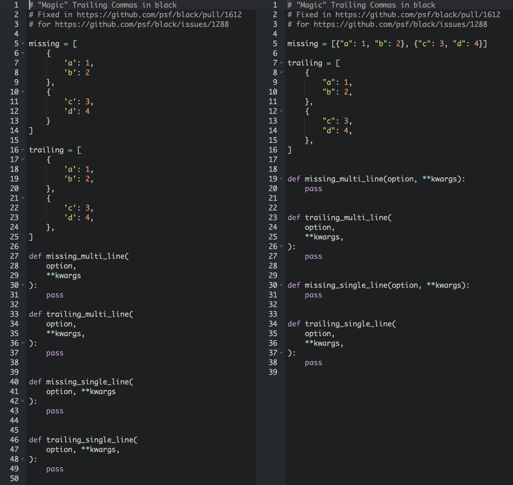

# Use trailing commas to control multi-line formatting in Black

From the [Black playground](https://black.now.sh/?version=stable&state=_Td6WFoAAATm1rRGAgAhARYAAAB0L-Wj4ALUARddAD2IimZxl1N_Wg0-CnXzYp5LKndBg8FYgyGXURCd7UsafoslhemGfwxiLRv8D8PxYh5YNhi7wODDvZ3BmJrbihvrlRY9NcUOU5FP0COCUPaFNaXGSCyDPDIqGloHkpuGqLBwZ_smT3xOne7_ElIFEksFyzy4KxovXsCSw8TVYt7vHAE2Lv_e2ZvVs47qLkEF9f_A7UY4hAepdQ-GUFha-9kE5PStqbY1e8XS9CXrcYSpBK13-SobXPwItzUPy2HudnRoAJK9KYDmSoM1gs-6YIlpoEB3fCBauICs7KlDBRcdvOhSdYqzNJs739Jgbq3hOiWt3iG9u0AGXYf55QPbnrvvHuP_Wl3DWrVXcK69gwrXlmR9qHLtAAAAR-obYj7nm58AAbMC1QUAACZtijKxxGf7AgAAAAAEWVo=):

Until [Black 20.8b0](https://github.com/psf/black/blob/master/CHANGES.md), the support was [incomplete](https://github.com/psf/black/issues/1288), and I posted [a comment illustrating the incorrect behavior](https://github.com/psf/black/issues/1288#issuecomment-635440203).

I think the new behavior is _much_ nicer, because it allows you to format nested data structures for readability, instead of line length. Unfortunately, it means that upgrading and running Black on an already-formatted codebase could result in another large batch of changes. For an example, see the [formatting changes in Twine](https://github.com/pypa/twine/pull/690/commits/5a61501c336739aaa812131f18a31b557e21686d).
